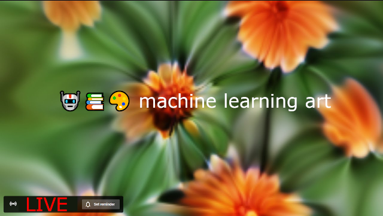

# 🤖📚🎨Machine Learning Art will take part in Data Fest!
&nbsp;
## [Data Fest](https://fest.ai/2020) is the main Data Science community organized event by [Open Data Science](https://ods.ai).

&nbsp;

### Our goal is to engage Data Scientists in the process of creating objects and tools of modern media and technological art. Creating collaborations between artists and scientists.
### During the conference we will hold several meetups with talks from various artists working with machine learning. 

&nbsp;

# September 19 Schedule:

&nbsp;

## 16:00 MSK [Alexander Mordvintsev](https://twitter.com/zzznah)
Alexander will talk about Differentiable Self-Organisation with Neural Cellular Automata.

Differentiable Self-Organisation is a practical way of designing distributed systems of locally communicating agents working together towards reaching a shared goal.

Neural Cellular Automata are examples of such systems. During this session he's going to give a glimpse of the “behind the stage“ process of designing and training Neural CA.

[Teaser](https://youtu.be/zRje8tRjcz8)

&nbsp;

## 17:00 MSK [Roman Kosovichev](https://www.artlebedev.com/romandkos/)
Roman will talk about the first in the world non-existed designer with real satisfied customers and how AI replaces humans in the design and creative fields. 

Would machines lead to new art-direction processes?

&nbsp;

## 18:00 MSK [Evgeny Kashin & Yuri Viazovetskyi](https://mlart.org/datafest)
Evgeny and Yuri will discuss the neural network art gallery, how it is constructed, and how to train the neural network to generate paintings. 

They will also talk about how to generate not just random paintings, but matching the user query.

&nbsp;

# How to participate:
Talks will be premiered in ML Art room in [spatial chat](https://spatial.chat/s/ods). 

You’ll need to find ML ART room in a room list!

To get a spatial chat invite, please register on [ods.ai](https://ods.ai) website. It will take no longer than 2 minutes, we promise! 

After each talk there will be a live Q&A session with the speaker.

&nbsp;

And we’ll be streaming the whole thing to youtube!

### See you there!
