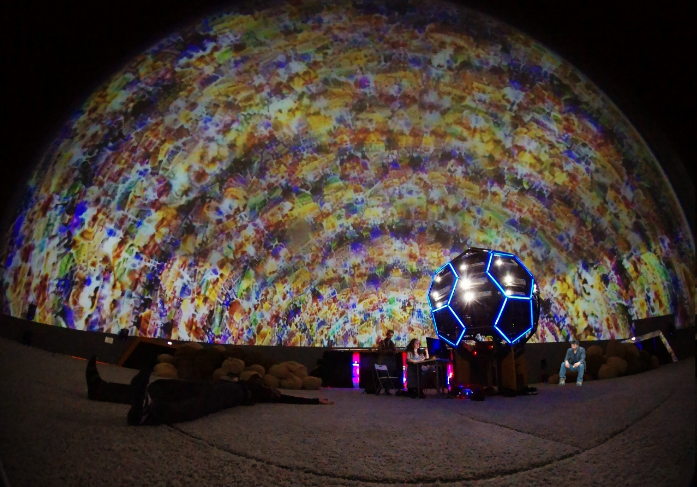

# Open Call for DataFest 2020

_English version below._

[Чтобы присоединиться, заполните анкету участника](https://forms.gle/sd2Qd3cLTNPKLMw29)

Приглашаем художников, музыкантов, разработчиков, ученых и всех, кто работает в направлении Science & Art с использованием алгоритмов машинного обучения, принять участие в оформлении онлайн-галереи Machine Learning Art в рамках Data Fest 2020. Data Fest – это крупнейшее мероприятие года, которое проводит сообщество Open Data Science. Мероприятие посвящено передовым результатам и разработкам в области AI и ежегодно собирает более 6 тысяч участников. 

Наша цель – вовлечь Data Scientist-ов, инженеров и ученых в процесс создания объектов и инструментов современного медиа- и технологического искусства. Знакомить художников и музыкантов с возможностями новейших алгоритмов машинного обучения. Создавать совместные проекты.  

У всех участников open-call есть возможность реализовать свои идеи в области Science & Art при помощи алгоритмов машинного обучения. Найти разработчиков и экспертов в различных областях AI, которые помогут в реализации проектов. Освоить state of the art алгоритмы, применяемые в современном медиа-искусстве.
 
На конкурс принимаются изображения, видео, музыкальные произведения, сгенерированные полностью или частично при помощи любых алгоритмов машинного обучения. 

До 1 августа мы будем проводить отбор готовых проектов для онлайн-галереи, а также оказывать экспертную поддержку в реализации идей, содействовать совместной работе художников и разработчиков. 

[Анкеты участников](https://forms.gle/sd2Qd3cLTNPKLMw29) принимаются до 1 августа.

Вопросы и мотивационные письма принимаются по адресу datafest@mlart.org

### English version: 

[To participate, please fill out this form](https://forms.gle/sd2Qd3cLTNPKLMw29)

We invite artists, musicians, developers, scientists and everyone who works in the field of Science & Art using machine learning algorithms to participate in the design of the Machine Learning Art online gallery as part of Data Fest 2020. Data Fest is the largest event of the year that holds the Open Data Science Community. The event is dedicated to advanced results and developments in the field of AI and annually gathers more than 6 thousand participants.

Our goal is to engage Data Scientists in the process of creating objects and tools of modern media and technological art. To acquaint artists and musicians with the capabilities of the latest machine learning algorithms. Creating collaboration between artists and scientists.

All open-call participants have the opportunity to realize their ideas in the field of Science & Art using machine learning algorithms. Find developers and experts in various areas of AI who will help in the implementation of projects. Learn to apply state of the art algorithms used in modern media art.
 
The online gallery accepts images, videos, music compositions, generated by using any machine learning algorithms.

Until August 1, we will conduct selection of projects for online galleries, as well as provide expert support in the implementation of ideas, promote the collaboration of artists and scientists. 

[Profiles of participants](https://forms.gle/sd2Qd3cLTNPKLMw29) are accepted until August 1.

Questions and motivation letters are accepted at datafest@mlart.org
